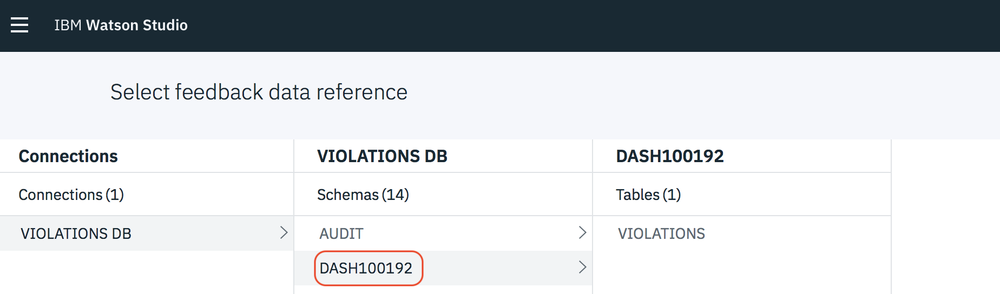
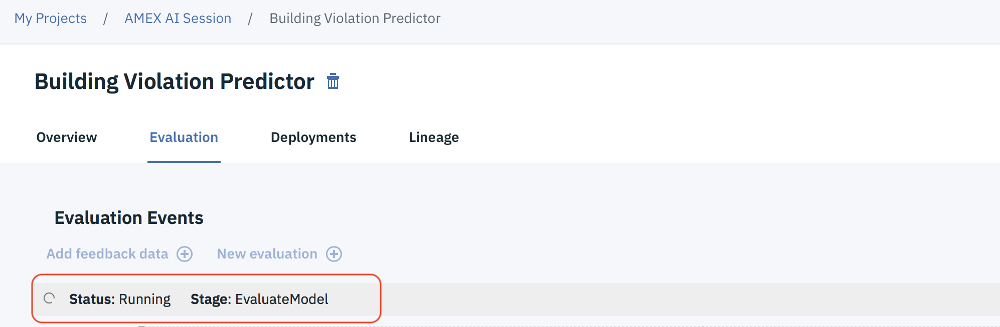

# IBM Client Developer Advocacy AI Series

## Lab - Continuous Learning with Watson Machine Learning

## Overview

This lab is based on the IBM Code Pattern [Continuous Learning with Watson Machine Learning and IBM Db2 Warehouse on Cloud](https://github.com/IBM/continuous-learning-with-watson-ml-and-db2).

In this lab, we will use IBM Watson Machine Learning and Watson Studio — which allows data scientists and analysts to quickly build and prototype models — to monitor deployments, and to learn over time as more data becomes available. Performance Monitoring and Continuous Learning enables machine learning models to re-train on new data supplied by the user or other data sources. All applications and analysis tools that depend on the model are automatically updated as Watson Studio handles the selection and deployment of the best model.

We’ll solve a problem for the City of Chicago using the Model Builder to model building violations. We’ll predict which buildings are most likely to fail an inspection, and we'll intelligently rank buildings by their likelihood to fail an inspection, saving time and resources for the city and building inspectors. We’ll begin by building a model on publicly available data as of September 2017. Then, we will introduce newer data from October, November, and December data to simulate learning and model re-training over time.

When the reader has completed this lab, they will understand how to:

* Use Watson Studio to create a project and associate services
* Use IBM Machine learning service to take advantage of machine learning models management (continuous learning system) and deployment (online, batch, streaming)
* Use Apache Spark-as-a-service cluster computing framework optimized for extremely fast and large scale data processing.
* Create and deploy self learning Watson Machine learning models

## Architecture

## Featured technologies

* [Artificial Intelligence](https://medium.com/ibm-data-science-experience): Artificial intelligence can be applied to disparate solution spaces to deliver disruptive technologies.
* [Machine Learning](https://en.wikipedia.org/wiki/Machine_learning): Machine learning is a field of artificial intelligence that uses statistical techniques to give computer systems the ability to "learn" (e.g., progressively improve performance on a specific task) from data, without being explicitly programmed
* [IBM Db2 Warehouse on Cloud](https://www.ibm.com/cloud/db2-warehouse-on-cloud): IBM Db2 Warehouse on Cloud is an elastic, fully managed cloud data warehouse service that's powered by IBM BLU Acceleration technology for increased performance and optimization of analytics at a massive scale.
* [Continuous Learning](https://en.wikipedia.org/wiki/Incremental_learning): Continuous learning is a method of machine learning, in which input data is continuously used to extend the existing model's knowledge i.e. to further train the model.

## Setup

If you haven't done this already, [sign up for an IBM Cloud account](https://cloud.ibm.com/login)

# Steps

1. [Create Watson Studio Project](#1-create-watson-studio-project)
2. [Add Db2 Warehouse on Cloud connection to Watson Studio Project](#2-add-db2-warehouse-on-cloud-connection-to-watson-studio-project)
3. [Add connected asset into Watson Studio](#3-add-connected-asset-into-watson-studio)
4. [Create Apache Spark as a service with IBM Cloud](#4-create-apache-spark-as-a-service-with-ibm-cloud)
5. [Create Watson Machine Learning with IBM Cloud](#5-create-watson-machine-learning-with-ibm-cloud)
6. [Add new Watson Machine Learning Model to Watson Studio](#6-add-new-watson-machine-learning-model-to-watson-studio)
7. [Add Feedback data and new evaluations to the continuously learning model](#7-add-feedback-data-and-new-evaluations-to-the-continuously-learning-model)
8. [Deploy the model to expose it through an API](#8-deploy-the-model-to-expose-it-through-an-api)
9. [Test the model](#9-test-the-model)

### 1. Create Watson Studio Project

a. Login in to IBM Watson Studio [https://dataplatform.cloud.ibm.com](https://dataplatform.cloud.ibm.com) using the same credentials you use for IBM Cloud.

b. Click on the tile **Create a Project**. Name the project, and then click on **Add** to add an Object Storage instance to your Watson Studio Instance. This will be used to permanently store any data that you upload to Watson Studio

c. Accept the defaults, scroll down and click the **Create** button. Click **Confirm**.

d. Click **Refresh** to load the details of the new Object Storage instance

e. Click **Create** to complete the New Project wizard.

### 2. Add DB2 Warehouse on Cloud connection to Watson Studio Project

a. Download the following files to your machine. You'll need them later to populate databases that you will create.

i. [buildings_source_inspection_data_2017.csv](https://raw.githubusercontent.com/ibm-ai-education/continuous-learning-with-watson-ml/master/data/buildings_source_inspection_data_2017.csv)

ii. [buildings_violations_September_v2.csv](https://raw.githubusercontent.com/ibm-ai-education/continuous-learning-with-watson-ml/master/data/buildings_violations_September_v2.csv)

b. Open another browser tab and navigate to https://cloud.ibm.com

c. Click on **Create resource**

d. On the left select the **Databases** category and then scroll down and click **Db2 Warehouse**.

e. Accept the defaults and click **Create**

f. On the left select **Service credentials**

g. Click on **New credential** and then click **Add**

h. Click on **View credentials** to show the credentials. Click on the **Copy** icon to copy the credentials to your clipboard.

i. Open up a new text file with your favorite text editor and paste the credentials (you'll need to refer to them later).

j. In the navigation area on the left click **Manage** and then click **Open console**

k. Click the hamburger icon at the top left and select **LOAD**

l. Click on **browse files** and select the file *buildings_source_inspection_data_2017.csv* that you downloaded earlier.

m. Click **NEXT**

n. Under **SCHEMA** select the first one (it should be something like *DASHnnnnnn*) and the click on **New Table**

o. Enter `VIOLATIONS` as the new table name and click **CREATE**. Click **Next**.

p. Click **Next** again and then click **Begin Load**

q. When the load completes click anywhere outside of the Notification Window to clear it

r. Repeat steps k-o using the file *buildings_violations_September_v2.csv* and naming the database `VIOLATIONS_FEEDBACK`

s. Go back to your Watson Studio tab and dlick **Add to project** and then click on **Connection**

t. Select **Db2 Warehouse** as the  connection type. Name the Connection *Violations DB* and provide the following values from the credentials you saved earlier

| Field |
| ------|
| Username |
| Password |
| Hostname |
| Database |

u. Verify that the new connection appears under **Data Assets**

### 3. Add connected asset into Watson Studio

a. Click **Add to project** again and then click on **Connected data**. Click **Select source**

b. Select the **VIOLATIONS** table under your *DASHnnnnnn* schema

c. Click **Select** and then name the asset *Violations*. Click **Create**

### 4. Create Apache Spark as a service with IBM Cloud

Since you'll be building a model with Apache Spark MLlib you'll be adding a Spark cluster to your project. Note that you can connect Watson Studio to your own  Spark clusters as well  

a. Click on the **Settings** tab for your project and then scroll down to the  **Associated services** section. Click **Add service***

b. Select **Spark** and then select the **Lite** plan. Click **Create**. Click **Confirm** when prompted.

### 5. Create Watson Machine Learning with IBM Cloud

The IBM Watson Machine learning service  provides all the machine learning models management (continuous learning system) and deployment (online, batch, streaming) capabilities so you'll need to add an instance to the project.

a. In the  **Associated services** section. Click **Add service*** again.

b. Select **Watson** and then click the **Add** link in the **Machine Learning** tile.

c. Accept the default values and click **Create**. Click **Confirm** when prompted.

### 6. Add new Watson Machine Learning Model to Watson Studio

Now you're ready to build a couple of Machine learning models and see which one performs better on the available historical data.

a. Click **Add to project** again and then click on **Watson Machine Learning model**.

b. Name the model `Bldg Violation Predictor`. Under **Select runtime** select the Spark instance you just created and then select  **Manual**.

c. Select the **Violations** Data asset you created earlier and click **Next**

d. Select **INSPECTION STATUS** as the column value to predict and then select **Multiclass Classification**. Click **Add Estimators**.

e. Select the **Decision Tree Classifier** and  click **Add**.

f. Click **Add Estimators** again, select the **Random Forest Classifier** and  click **Add**. Click **Next**

g. The models will be trained on the data provided and the results will be displayed . Wait for the status of both models to indicate that they have been trained and evaluated.

h. Click **Save** to save the **Decision Tree** model.

### 7. Add Feedback data and new evaluations to the continuously learning model

Next you'll simulate continuous learning by injecting more recent  data into the model and seeing if the change in results  is enough to warrant rebuilding and/or redeploying the model automatically.

a. Click on the **Evaluation** tab, scroll down and then click **Configure performance monitoring**

b. Select your Spark instance, and then  select the metric **weightedFMeasure** and enter `0.97` as the threshold

c. Click on **Select feedback data reference** and select the **VIOLATIONS_FEEDBACK** table under your *DASHnnnnnn* schema. Click **Select**

d. For **Auto Retrain** select **when model performance is below threshold**

e. Click **Save** and then click on **New Evaluation**

f. Monitor the status of the operation as it runs the new data through the model and then triggers a model retrain.

g. Now is a good time for a coffee break as retraining the model  will take a few minutes. Leave the browser tab with the  status  open. Wait for the status to change to **Complete** before continuing.

### 8. Deploy the model to expose it through an API

Next you'll create a deployment so that the model can be invoked as a service via REST calls.

a. Click on the **Deployments** tab. Click **+ Add Deployment** to add a new deployment

b. Name the deployment `Violation Predictor` and click **Save**.

c. Wait for the status of the new deployment to change to **DEPLOY_SUCCESS**

### 9. Test the model

a. Click on the name of the deployment to bring up the details of the deployment.

b. Click on the **Test** tab and enter the following values (matching the case exactly)

| Field | Value |
| ------|-------|
| VIOLATION_CODE| CN196019 |
| VIOLATION_STATUS | OPEN |
| INSPECTION_CATEGORY | COMPLAINT |
| PROPERTY_GROUP| small |
| LONGITUDE | -87.700381  |
| LATITUDE | 41.901459 |
| DEPARTMENT_BUREAU | CONSERVATION |

c. Click **Predict** and verify the prediction is **FAILED**

## Learn more

* **Artificial Intelligence Code Patterns**: Enjoyed this lab ? Check out our [AI Code Patterns](https://developer.ibm.com/technologies/artificial-intelligence/).
* **AI and Data Code Pattern Playlist**: Bookmark our [playlist](https://www.youtube.com/playlist?list=PLzUbsvIyrNfknNewObx5N7uGZ5FKH0Fde) with all of our Code Pattern videos

## License

This lab is licensed under the Apache Software License, Version 2.  Separate third party code objects invoked within this code pattern are licensed by their respective providers pursuant to their own separate licenses. Contributions are subject to the [Developer Certificate of Origin, Version 1.1 (DCO)](https://developercertificate.org/) and the [Apache Software License, Version 2](https://www.apache.org/licenses/LICENSE-2.0.txt).

[Apache Software License (ASL) FAQ](https://www.apache.org/foundation/license-faq.html#WhatDoesItMEAN)
